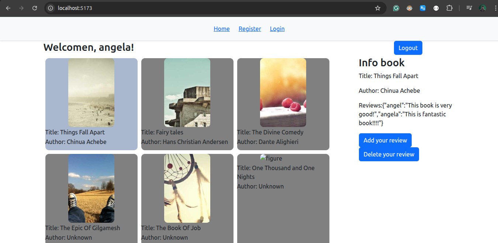

# 📚 Book Review App

This is a fullstack application to **practice and understand Express.js** for the backend and **React** for the frontend. It allows users to register, log in, and add/edit/delete reviews on books.

<div align="center">
  
</div>

## 🛠 Tech Stack

- **Frontend**: React + React Router + Bootstrap
- **Backend**: Express.js + JWT + CORS
- **Auth**: JSON Web Tokens stored in `localStorage`


## 🚀 How to Run

```bash
# In one terminal: Start backend
cd server
npm install
node index.js

# In another terminal: Start frontend
cd client
npm install
npm run dev
```

## ✍️ Features

- JWT-based auth
- Register/Login
- See book list
- Add/Edit/Delete your own review

## 🧠 Notes
- UI is basic for learning purpose
- Core goal: improve Express and JWT understanding

## ✍️ Goal

- Practice Express routing and middleware
- Learn to manage protected routes using JWT